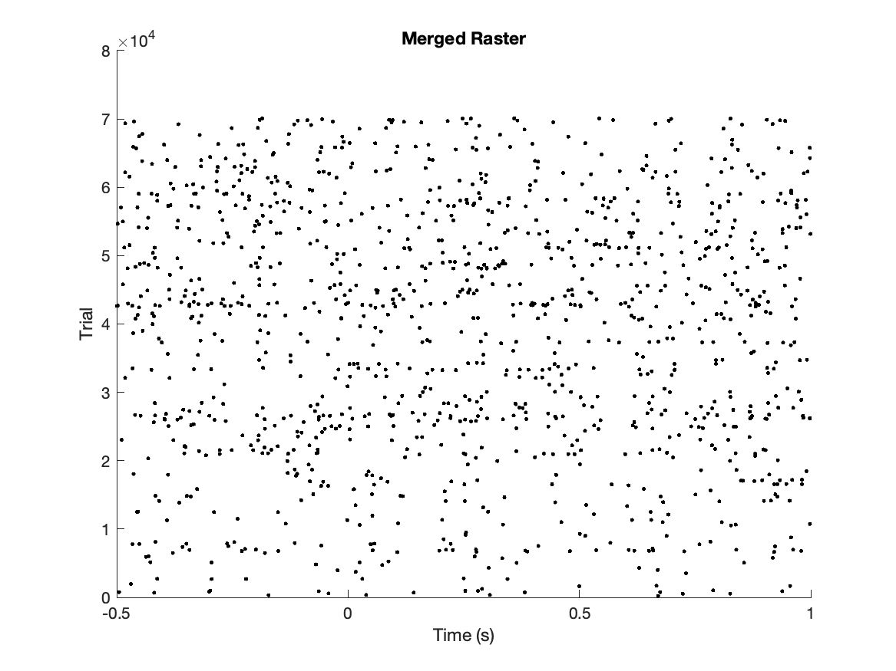
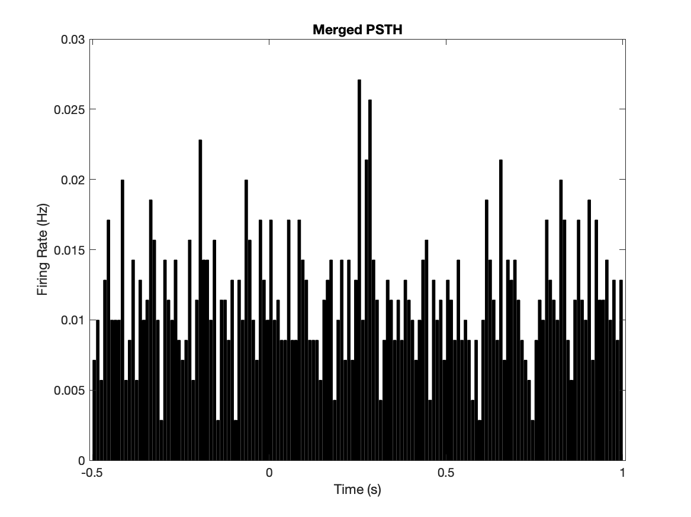

# Event-Aligned Neural Spike-Train Analysis

MATLAB workflow for exploring spike timing around recorded events: pooled raster plots, peri-stimulus time histograms (PSTHs), and an exploratory ranking of candidate alignment codes.




*Existing repository outputs, retained as examples. Raw recordings and acquisition metadata are not included, so their provenance and exact regeneration cannot be independently verified from this repository.*

## Research question and workflow

How does the pooled firing-rate profile change around an event, and which event codes produce a prominent aligned response?

1. Read spike timestamps from `data.chan1a` and event time/code pairs from `strobed` in locally supplied MAT files.
2. Select events matching `alignCode` (currently `0`). Files whose names contain `plxAnaAD` are excluded.
3. Align spikes within −0.5 to +1 second and count them in 10 ms bins.
4. Average trial counts and divide by bin width to express the pooled PSTH in Hz.
5. Optionally inspect odd/even event groups and rank alternative alignment codes.

`score_all_alignments.m` ranks candidates using baseline-normalized peak height, a bonus for peaks within 100 ms of alignment, and the post-minus-pre-event firing-rate difference. Baseline bins have centers below −0.2 s. This is a heuristic mixing differently scaled terms, not a statistical test or validated event identification procedure. Selecting an alignment on the same data is exploratory; event meaning must come from acquisition metadata.

## Run locally

Use MATLAB with `histcounts`, `smoothdata`, tables, and recursive `dir` support. The original MATLAB release is not recorded; no MATLAB runtime was available for validation of this update.

Place only recordings you are authorized to use under `data/` (ignored by Git). Each MAT file must contain:

| Field | Expected content |
| --- | --- |
| `data.chan1a` | Numeric vector of spike timestamps, in seconds |
| `strobed` | Numeric matrix: column 1 event time in seconds; column 2 event code |

From the repository directory:

```matlab
% Optional exploratory search; inspect outputs/alignment_scores.csv.
bestAlignCode = score_all_alignments();
% Set alignCode inside main_script.m explicitly; it is not assigned automatically.
main_script
```

Check timestamp units, channel identity, event definitions, and trial ordering before running. `main_script` clears the workspace and saves figures in `outputs/`; rerunning overwrites matching output names. No raw data download is provided.

## Interpretation and limitations

- **Condition labels are assumptions.** The code assigns odd events to “Vision” and even events to “No Vision” separately within each file. It does not decode experimental condition metadata. These labels cannot establish a condition effect until verified.
- **A difference above 5 Hz is descriptive, not statistical significance.** Markers use the absolute difference between unsmoothed group PSTHs. Displayed curves use five-bin Gaussian smoothing. No hypothesis test, p-value, confidence interval, or multiple-comparison correction is computed.
- Trials are pooled across files, weighting files with more events more heavily. The code does not model session, neuron, or subject dependence. Overlapping windows can reuse spikes.
- Missing fields and loading errors are skipped. Review console diagnostics before interpreting pooled outputs.

The historical [comparison figure](outputs/vision_comparison_with_stats.png) and `outputs/vision_comparison_stats.mat` retain legacy naming (including `significantBins`). Those names and star markers do **not** imply statistical significance. They are preserved as historical artifacts rather than silently relabeled or regenerated without the source recordings. Updated runs write `vision_comparison_descriptive.png` and `vision_comparison_summary.mat`, with `differenceBins` for the descriptive mask.

## Repository guide

| File | Purpose |
| --- | --- |
| `main_script.m` | Load, align, pool, visualize, and save descriptive group summaries |
| `computePSTH.m` | Trial-by-bin spike counts; normalization occurs in the caller |
| `score_all_alignments.m` | Exploratory event-code ranking and CSV export |
| `outputs/` | Existing figures and historical descriptive summary |

Raw or restricted research data should remain outside version control. The included figures are examples already present in the public repository, not new evidence of a biological effect.
